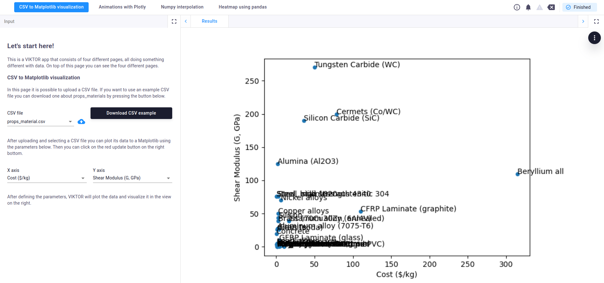
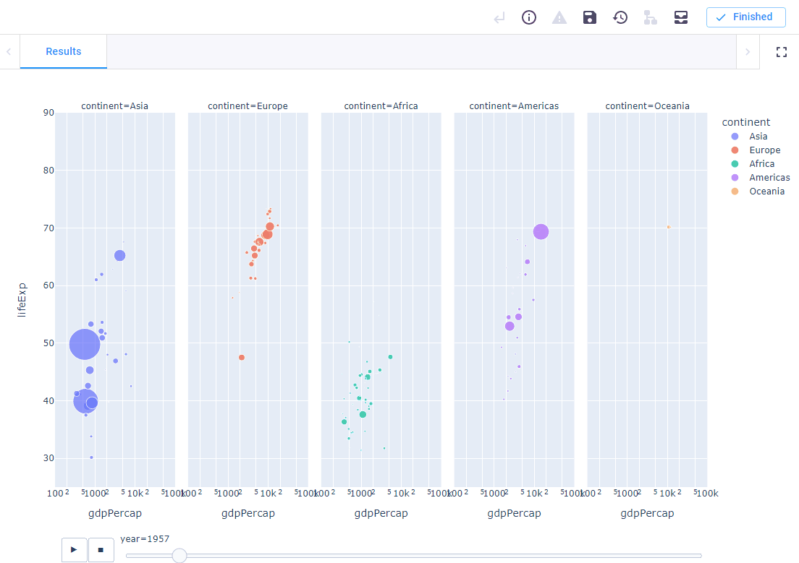
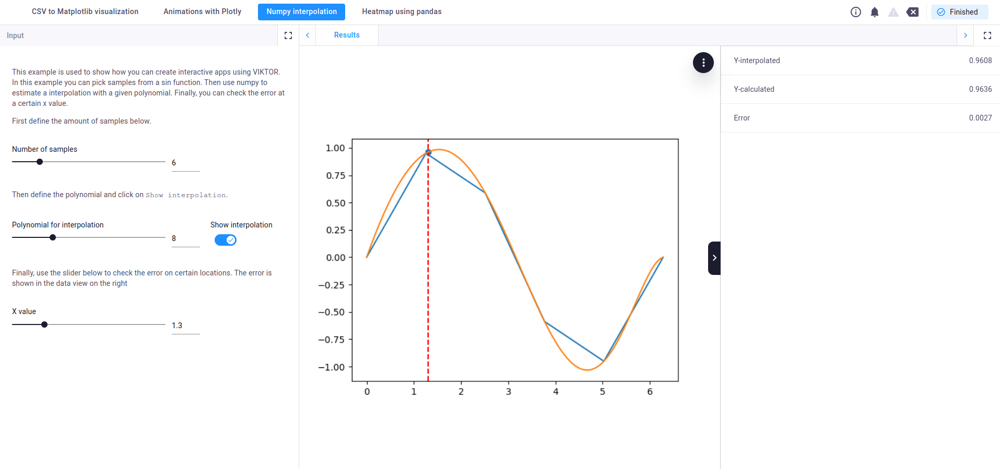
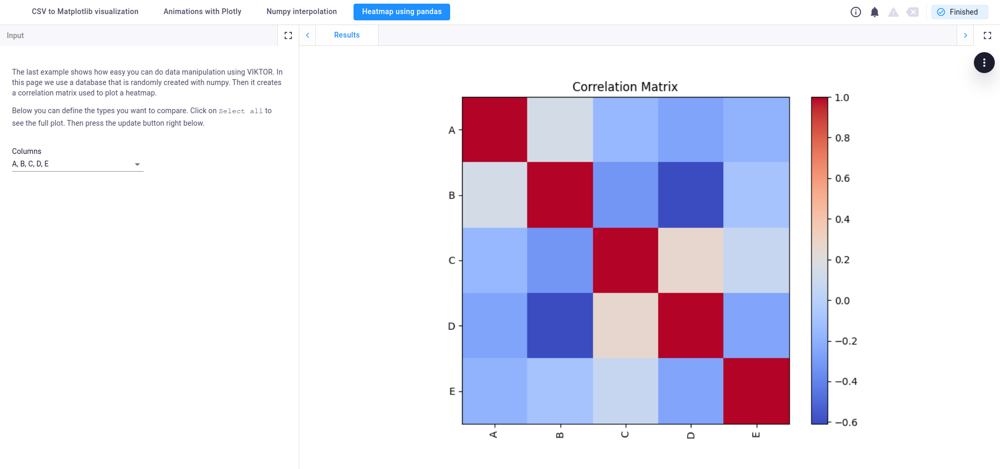

# Data science
This is a VIKTOR app that consists of four different pages, all doing something different with data. On top of this 
page you can see the four different pages.

Use the [free version](https://www.viktor.ai/try-for-free) or apply for a [demo account](https://www.viktor.ai/try-for-free)
to try the functionality yourself!

### 1. CSV to Matplotlib visualization
In the first page it is possible to upload a CSV file. If you want to use an example CSV file you can download one
about material properties. After uploading and selecting a CSV file you plot its data using Matplotlib.

### 2. Animations with Plotly
In the 2nd page is shown how easy it is to integrate VIKTOR with other libraries like Plotly. 
This example is created with just 3 lines of code!

### 3. Numpy interpolation 
The third example is used to show how you can create interactive apps using VIKTOR. 
In this example you can pick samples from a sin function. 
Then use Numpy to estimate a interpolation with a given polynomial. 
Finally, you can check the error at a certain x value.

### 4. Heatmap using pandas
The last example shows how easy you can do data manipulation using VIKTOR. 
In this page we use a database that is randomly created with Numpy. Then Pandas is used
to create a correlation matrix which is used to plot a heatmap.

