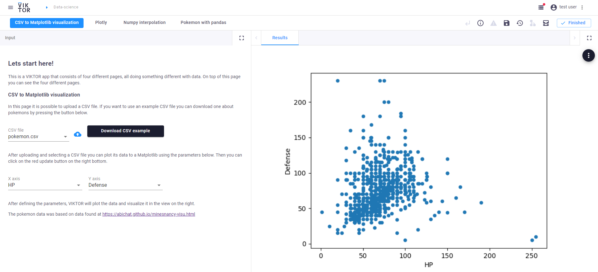

 

# Sample app data science
This is a VIKTOR app that consists of four different pages, all doing something different with data. On top of this 
page you can see the four different pages.

Use the [free version](https://www.viktor.ai/try-for-free) or apply for a [demo account](https://www.viktor.ai/try-for-free) to try the functionality yourself! 

### 1. CSV to Matplotlib visualization
In the first page it is possible to upload a CSV file. If you want to use an example CSV file you can download one about pokemons or one about the properties of different materials.
After uploading and selecting a CSV file you can plot its data to a Matplotlib using the parameters

### 2. Plotly integration
In the 2nd page is shown how easy it is to integrate VIKTOR with other libraries like Plotly. 
This example is created with just 3 lines of code!

### 3. Numpy interpolation 
The third example is used to show how you can create interactive apps using VIKTOR. 
In this example you can pick samples from a sin function. 
Then use numpy to estimate a interpolation with a given polynomial. 
Finally, you can check the error at a certain x value.

### 4. Pokemon with pandas
The last example shows how easy you can do data manipulation using VIKTOR. 
In this page we use the same pokemon database as before. 
Here the pandas library is used to manipulate data by first removing all data-entries missing a value for its type. 
Then it creates a corralation matrix used to plot a heatmap.

